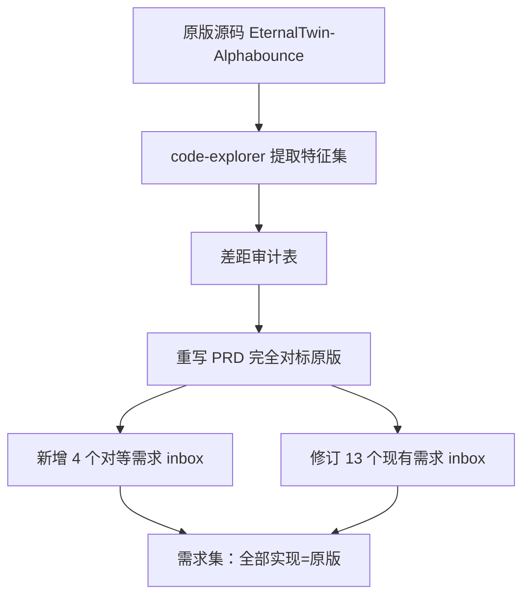

## 用户需求

**原始诉求**：完整梳理一遍剩余需求，判断其是否能达到「在安卓上完整重构该游戏、不降级、同样画面/操作/任务等」的目标；若不能，则重新生成对应的需求文档。

**澄清结论**：

- 原版 Haxe/Pixi 源码与美术/音频资源可获取，路径 `D:\Project\Self\EternalTwin-Alphabounce`（EternalTwin-Alphabounce）。
- 对等基线界定为**完全对标原版**：需求须覆盖全部 11 种敌人 + Boss、原版关卡/任务数据，移除一切降级式 Out of Scope，确保不降级。

## 审计结论（核心，决定需重新生成文档）

当前剩余 inbox 需求（R01–R14 + 物理/方块基础，共 16 份）在**系统结构**上覆盖完整（物理、方块、Pad、关卡、碰撞、任务、商店、存档、敌人、输入、状态机、导弹、音频、粒子、UI、导出），可达成「可玩」；但**不满足「不降级/同样画面操作任务」**，存在四类硬性缺口：

1. **资产缺口**：仓库 `game/` 下无任何原版精灵图/音频（仅真机截图），「同样画面/音效」无物可对标——需新增「资产迁移」需求。
2. **敌人降级**：`20250101130007-敌人系统.md` 明确 Out of Scope「不做全部 11 种敌人、不做 Boss 战」，直接违背「不降级/同样任务」（原版 glossary 定义 11 种 + Boss）。
3. **物理模型偏离**：已实现 `game/scripts/entities/ball.gd` 用手写速度追踪（`if not is_launched: return; step_physics`），与 PRD `ADR-001`（须 `CharacterBody2D.move_and_slide()`）相悖，物理手感无法对等原版。
4. **内容对等基线缺失**：原版关卡/任务/敌人具体定义、动画/画面表现、控制手感未以「对等原版」为验收基线；任务/商店/关卡数据为待定义，须从原版搬运。

**结论**：剩余需求**不能**独立达到「完整重构不降级」目标，必须重新生成需求文档，建立完全对标原版的验收基线。

## 计划目标

重新生成一套需求文档（重写 PRD + 新增 4 个对等需求 + 修订现有需求），使「全部实现即等于原版」：验收基线=完全对标原版、移除降级范围、补齐资产/内容/物理/画面四类对等规格。

## 技术栈与方案

- **文档体系**：沿用 xijia 流水线（`/xijia:prd-to-requirement` 拆 PRD → `inbox/*.md` 带 Gate-0~3 门禁），frontmatter 须含中文 `分级/类型/状态`（`STATUS_VALUES`/`TIER_VALUES` 受 `guardlib` 校验约束）。
- **真机验收门禁**：`42-verification-output.mdc` 第 11 条「真机验收门禁」对游戏/物理/交互需求强制 android-debug 闭环（构建→安装→启动→截图→logcat 无 ERROR→交互）；重新生成的需求须把「真机闭环」写入每条 AC 的验证方式。

## 实现方法（高层策略）

1. **差距审计**：将 16 份剩余需求逐项对照「完整重构不降级」基线，产出差距表（写入 PRD 缺口分析补充）。
2. **原版特征提取**：用 `code-explorer` 遍历 `D:\Project\Self\EternalTwin-Alphabounce`，提取

- 敌人全类型（11 + Boss）行为/属性/状态机（参考 `frontend/src/haxe/ev/` 与 glossary）；
- 关卡数据结构与数值、任务/商店内容（原版 `MissionInfo`/`ShopManager` 数据层）；
- 精灵/音频资源清单与命名约定；
- 原版物理/控制/手感模型（Pixi 自定义实现细节）。

3. **重写 PRD**：验收基线改为「完全对标原版」；删除降级式 Out of Scope；新增「资产迁移 / 原版内容数据搬运 / 物理对等 / 画面动画对等」四章；将 11 敌 + Boss 纳入 R08。
4. **新增 4 个 inbox 需求**：资产迁移、原版内容数据搬运、物理对等校验（对齐 ADR-001 `CharacterBody2D`）、画面/动画对等规格。
5. **修订现有需求**：敌人系统覆盖全量、球体物理对齐 ADR-001、任务/商店/关卡网格补原版数据基线、Pad/输入对齐原版控制手感、音频/粒子对齐原版资源与反馈。

## 关键技术决策与权衡

- **为何新增而非仅改 PRD**：资产与物理对等是独立可测闭环，拆为独立需求便于各自 Gate 验收与真机证据留痕，避免单文档过大。
- **为何坚持 ADR-001**：手写速度与 Godot Physics2D 碰撞系统不兼容，球-块/球-敌碰撞集成会失真，必须回归 `CharacterBody2D.move_and_slide()` 才能对等原版手感。
- **资产来源已确认**：原版资源在 `D:\Project\Self\EternalTwin-Alphabounce`，资产迁移需求须强制「资源导入 + 命名映射 + 真机视觉比对」，确保像素级/等效画面。
- **性能/可维护性**：需求文档仅定义验收基线与落点，不绑定具体 Godot API 实现细节（除 ADR-001 物理约定），保持实现期取舍空间。

## 架构与文档结构



## 目录结构与文件清单

```
docs/requirements/
├── prd-android-complete.md              # [MODIFY] 重写：验收基线=完全对标原版；移除降级 Out of Scope；新增资产/内容/物理/画面对等章节；R08 纳入 11 敌+Boss
├── inbox/
│   ├── 20250101120001-物理系统基础.md    # [MODIFY] 注明 Game 接入在 R03/R04；物理对等待 R03 对齐 ADR-001
│   ├── 20250101120002-方块系统基础.md    # [MODIFY] 补原版方块类型/数值/击破基线
│   ├── 20250101130000-Pad发射台系统.md   # [MODIFY] 对齐原版瞄准/发射手感与控制
│   ├── 20250101130001-关卡网格与关卡数据系统.md # [MODIFY] 原版关卡数据基线（JSON 字段对等）
│   ├── 20250101130002-球体物理系统完整化.md   # [MODIFY] 对齐 ADR-001：CharacterBody2D.move_and_slide()
│   ├── 20250101130003-球-块碰撞集成.md   # [MODIFY] 碰撞回调对齐原版
│   ├── 20250101130004-任务系统.md        # [MODIFY] 原版任务/奖励数据基线
│   ├── 20250101130005-商店系统.md        # [MODIFY] 原版商品/兑换数据基线
│   ├── 20250101130006-玩家存档系统.md    # [MODIFY] 存档字段对齐原版
│   ├── 20250101130007-敌人系统.md        # [MODIFY] 覆盖 11 种+Boss；删除降级 Out of Scope；引用原版 ev/ 行为
│   ├── 20250101130008-触摸输入映射配置.md # [MODIFY] 对齐原版控制动作
│   ├── 20250101130009-游戏循环状态机与关卡管理.md # [MODIFY] 含原版通关/GameOver 规则
│   ├── 20250101130010-导弹系统.md        # [MODIFY] 对齐原版导弹逻辑
│   ├── 20250101130011-音频系统.md        # [MODIFY] 原版音频资源映射表
│   ├── 20250101130012-粒子特效系统.md    # [MODIFY] 对齐原版消除/击中反馈特效
│   ├── 20250101130013-完整UI层与Android导出验证.md # [MODIFY] 原版布局/按钮对等
│   ├── NEW-资产迁移.md                   # [NEW] 精灵/音频导入 + 命名映射 + 真机视觉比对
│   ├── NEW-原版内容数据搬运.md           # [NEW] 关卡/任务/敌人原始定义搬运为 JSON/资源
│   ├── NEW-物理对等校验.md               # [NEW] 对齐 ADR-001 Godot Physics 手感对等
│   └── NEW-画面动画对等规格.md           # [NEW] 布局/特效/反馈/动画对等规格
```

## Agent Extensions

### Skill

- **xijia-prd-to-requirement**
- 用途：将重写后的 PRD 规范拆解为带 frontmatter（分级/类型/状态中文值）与 Gate-0~3 结构的 inbox 需求文档，保证与 xijia 流水线一致。
- 预期结果：产出可直接 `/xijia:start` 进入门禁流程的需求集，frontmatter 通过 `guardlib` 校验。

### SubAgent

- **code-explorer**
- 用途：遍历 `D:\Project\Self\EternalTwin-Alphabounce`（Haxe/Pixi 原版），提取敌人 11+Boss 行为、关卡/任务/商店数据、精灵/音频资源清单、物理控制模型。
- 预期结果：输出结构化的原版特征集，作为 PRD 重写与需求修订的事实基线，避免凭记忆臆测。

### Skill

- **xijia-ops-pipeline**
- 用途：文档生成后，按 Gate-0~3 推进任一时统一编排入口；本计划聚焦文档生成阶段，后续每条需求落地沿用此流水线。
- 预期结果：需求集具备可逐条进入门禁、验证、归档的完整形态。