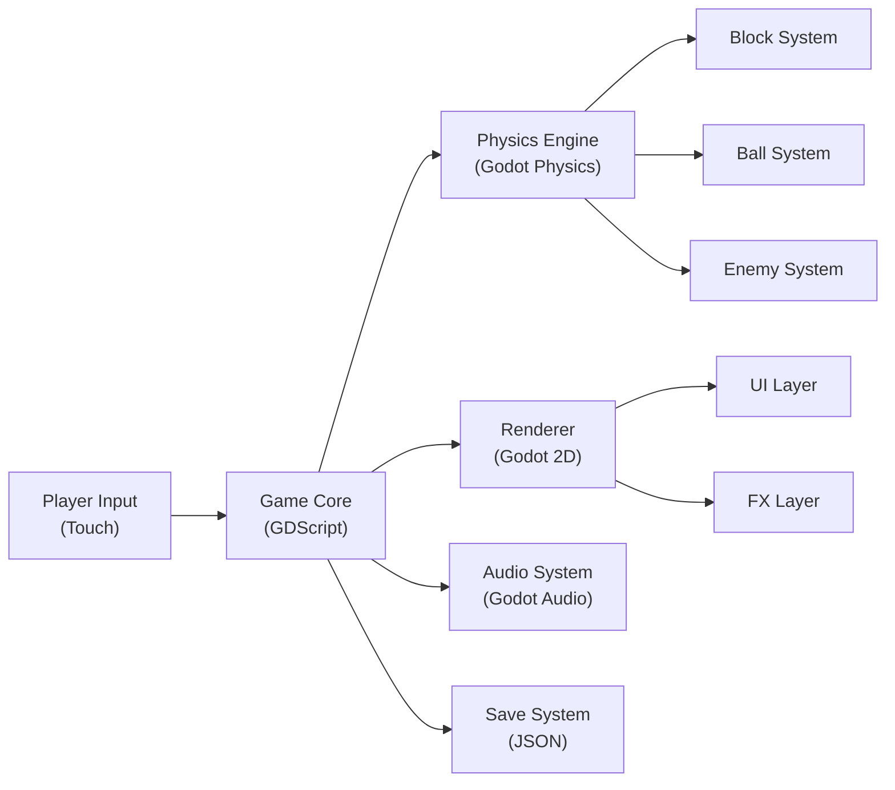

# 架构总览（Architecture Overview）

## 系统目标

- **项目**: Alphabounce_M
- **目标**: 将 Haxe/Pixi.js 版 AlphaBounce 游戏完整迁移到 Godot 4.x + GDScript，支持 Android 平台

## 系统总览



## 模块边界

### 核心游戏模块

| 模块 | 职责 | 源文件映射 |
|------|------|-----------|
| `Game` | 游戏主循环、状态管理 | `frontend/src/haxe/Game.hx` |
| `Element` | 物理实体基类、碰撞检测 | `frontend/src/haxe/Element.hx` |
| `Level` | 关卡生成、方块管理 | `frontend/src/haxe/Level.hx` |
| `Pad` | 发射台控制 | `frontend/src/haxe/Pad.hx` |
| `Block` | 方块逻辑 | `frontend/src/haxe/Block.hx` |

### 实体模块

| 模块 | 职责 | 源文件映射 |
|------|------|-----------|
| `Ball` | 球体物理、碰撞 | `frontend/src/haxe/el/Ball.hx` |
| `Shot` | 导弹系统 | `frontend/src/haxe/el/Shot.hx` |
| `Enemy` | 敌人基类 | `frontend/src/haxe/ev/` |
| `Molecule` | 分子敌人 | `frontend/src/haxe/el/Molecule.hx` |

### 系统模块

| 模块 | 职责 | 源文件映射 |
|------|------|-----------|
| `ZoneInfo` | 星球区域数据 | `common/src/ZoneInfo.hx` |
| `MissionInfo` | 任务系统数据 | `common/src/MissionInfo.hx` |
| `PlayerInfo` | 玩家状态 | `common/src/PlayerInfo.hx` |
| `ShopInfo` | 商店数据 | `common/src/ShopInfo.hx` |

## 分层架构

```
┌─────────────────────────────────────────┐
│           UI Layer (Control)            │
├─────────────────────────────────────────┤
│        Game Logic (Node)                │
│  ┌──────────┬──────────┬────────────┐  │
│  │ Physics  │ Entity   │ Mission    │  │
│  │ System   │ System   │ System     │  │
│  └──────────┴──────────┴────────────┘  │
├─────────────────────────────────────────┤
│         Data Layer (Resource)           │
│  ┌──────────┬──────────┬────────────┐  │
│  │ Zone     │ Mission  │ Player     │  │
│  │ Info     │ Info     │ Info       │  │
│  └──────────┴──────────┴────────────┘  │
└─────────────────────────────────────────┘
```

## Godot 项目结构

```
game/
├── scenes/
│   ├── main/
│   │   ├── Main.tscn          # 主菜单
│   │   ├── Game.tscn          # 游戏主场景
│   │   └── Level.tscn         # 关卡场景
│   ├── ui/
│   │   ├── HUD.tscn           # 抬头显示
│   │   ├── Shop.tscn          # 商店界面
│   │   └── MissionPanel.tscn  # 任务面板
│   └── entities/
│       ├── Ball.tscn          # 球体
│       ├── Block.tscn         # 方块
│       └── Enemy.tscn         # 敌人
├── scripts/
│   ├── core/
│   │   ├── game.gd            # 游戏主逻辑
│   │   ├── level.gd           # 关卡管理
│   │   └── physics.gd         # 物理系统
│   ├── entities/
│   │   ├── ball.gd            # 球体
│   │   ├── block.gd           # 方块
│   │   └── enemy/             # 敌人脚本
│   └── systems/
│       ├── mission.gd         # 任务系统
│       ├── shop.gd            # 商店系统
│       └── player.gd          # 玩家系统
└── resouces/
    ├── textures/
    └── audio/
```

## 技术栈确认

- **游戏引擎**: Godot 4.7.1
- **编程语言**: GDScript
- **目标平台**: Android
- **构建系统**: Godot Export Presets
- **版本控制**: Git

## compiled_truth

当前技术栈（栈真相源）：
- Godot 4.7.1
- GDScript
- Android Export
- JDK 17
- Android SDK 34
- FastAPI (legacy reference)
- Vue3 (legacy reference)
- Element Plus (legacy reference)
- SQLAlchemy (legacy reference)
- Alembic (legacy reference)
- metric_hub (legacy reference)
